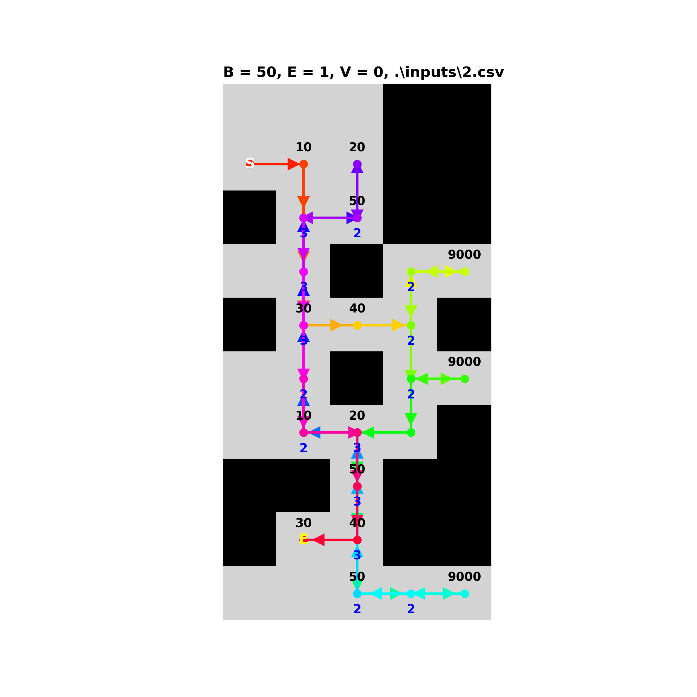

# Homework 1 Write Up
## Assignment: Intelligent Vacuum Cleaner Agent
Mārtiņš Pr.

Run with
```
go run . optimal ./inputs/6.csv
# or
cleaner.exe optimal ./inputs/6.csv
```

### Algorithm
Algorithm combines both **breadth-first-search** and **greedy** one to achieve the pre-defined goals:
- **Primary Goal**: Clean as much dirt as possible.
- **Secondary Goal**: Clear (visit and clean) as many squares as possible.

Agent actions follow the logic:
1. The agent starts by vacuuming its current position if there's dirt to clean.
2. It then explores its immediate neighbors (north, west, east, south). The tile with the highest value is selected. This way without much of cost, the agent explores low-cost gains (**greedy**). 
3. If the agent doesn't find any valuable neighboring tiles, it searches globally  using BFS. BFS finds the most dirty tile (target) within the agent's battery range. 
4. BFS search explores tiles one by one ensuring the agent takes the shortest path to the target. 
5. Once the agent arrives to the target, the logic is repeated and searches for further iterations. On each move, vacuuming is done if there is something to vacuum.

Initially, this was meant to be used to balance short-term greedy actions with a more strategic global search. That is: local conditions combined with overall goals.

### Results
Here are results for each of the manually crafted input files from the vizualizer script.  
One can simulate the results with
```
go run . optimal ./inputs/6.csv | python .\writeup\vizualize.py .\inputs\6.csv
```
| | | |
|-|-|-|
|  |  |  |
|  |  |  |
|  |  |  |


### Conclusions

By analyzing the paths using human judgement one can conclude that the algorithm presents strengths and weaknesses and could be improved.

Strengths:
- Given suffienct battery, **all tiles are visited** by trying to visit the most valuable ones at the beginning.
- **Battery is managed in an efficient way**, not interrupting the robot on zero-value tiles and maximizing its use if further tiles are achievable.
- The algorithm effectively **cleans dirt close to its current position**, which can be beneficial in densely dirty areas.
- **Balancing between a greedy strategy and BFS** allows the algorithm to adapt to different distributions of dirt.

Weaknesses:
- The greedy component focuses heavily on immediate (one tile away) gains, which can lead to **non-optimal paths** (see `4.csv` path vizualization).
- While BFS helps find distant dirt, on specific grid designs **it may miss complex paths** (see `7.csv` or `8.csv`).

The biggest challenge in the assignment was the algorithm choice. Initially greed-only algorithm was created (code still in `algorithm.go` file), but it was very inefficient. Then A* was implemented, but the implementation failed to acknowledge multiple high-value tiles and sometimes halted the operation before visiting all tiles. While still far from ideal, a hybrid (current) implementation was chosen.
