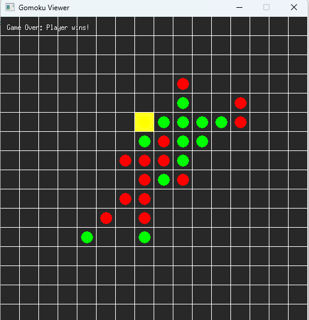

# Midterm: Gomoku Bot
Martins P

To play, from `src/bot`:
```
go run . -id=RDB99999
```
`-server=http://0.0.0.0:55555` may also be specified.


This is my take at creating a bot playing 16x16 Gomoku board.
It implements three modes:
- human mode (playing against the bot manually),
- gomokuOnline bot (playing against the API of [gomokuonline.com](https://gomokuonline.com/)),
- production mode (connecting to the midterm server).

Running these modes can be visualized with the viewer that uses a file to communicate between the visual and agent part.

Here is an example of a finished game:



The core AI logic can be found in `agent.go`, and is as follows:
1. block opponent's five-in-a-row,
2. create four-in-a-row if available, so that the next move could be possibly won,
3. block opponent's four-in-a-row,
4. do minmax with depth adjusted depending on the time left with such considerations:
   1. use transposition table to later retained already computed positions,
   2. use alpha-beta pruning to exit early during possible move traversal,
   3. detect various board patterns (as half-open three, open two or split three) and assign each of them some score,
   4. exit from traversal if allowed time is up.

The improvements were made against playing the gomokuOnline (100% win rate), random bot (100% win rate) and trying to beat previous version of my own bot (at the latest iteration 70-75%). 


## References
- Approach was influenced by the [Giang-Dang/gomoku-AB-pruning](https://github.com/Giang-Dang/gomoku-AB-pruning) project.
- Copilot with Claude 3.7 Sonnet (Preview) was used in this work.
- Initial experimental example in Python was created by ChatGPT [here](https://chatgpt.com/share/67b0f680-f48c-8007-9b64-5aca4c3f25e6). 